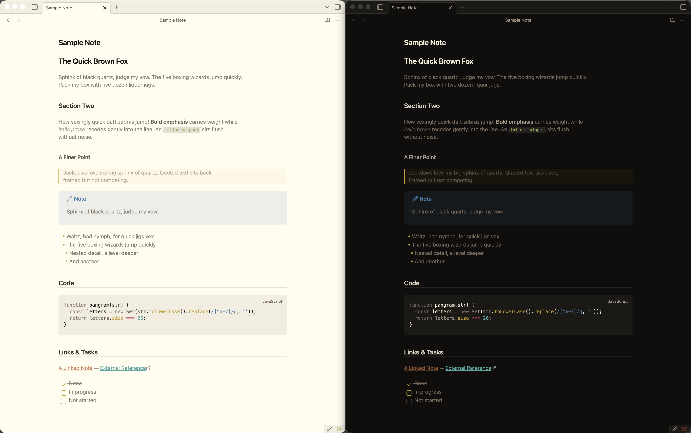

# Flynt for Obsidian

Warm tones. Zero visual noise. - [Flynt](https://flynt-theme.github.io/flynt) for [Obsidian](https://obsidian.md).



## Install

Search for **Flynt** in Settings - Appearance - Themes.

### Manual

1. Download `theme.css` from this repository
2. Copy it to `<vault>/.obsidian/themes/Flynt/theme.css`
3. Select Flynt in Settings - Appearance - Themes

## Building from source

The theme is generated from [`theme.css.tmpl`](theme.css.tmpl) using [strike](https://github.com/flynt-theme/flynt/tree/main/strike).

```sh
strike build theme.css.tmpl --combined
```

## License

MIT - [Flynt Theme](https://github.com/flynt-theme)
